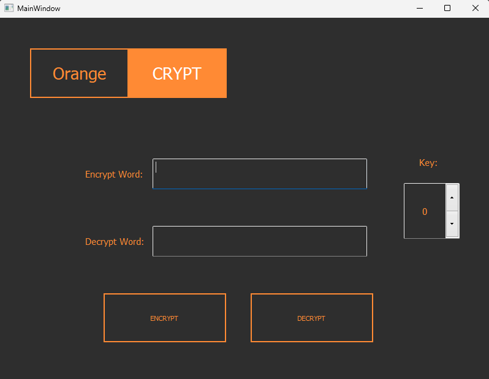
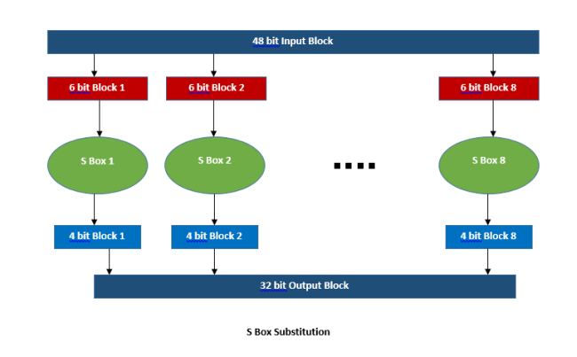
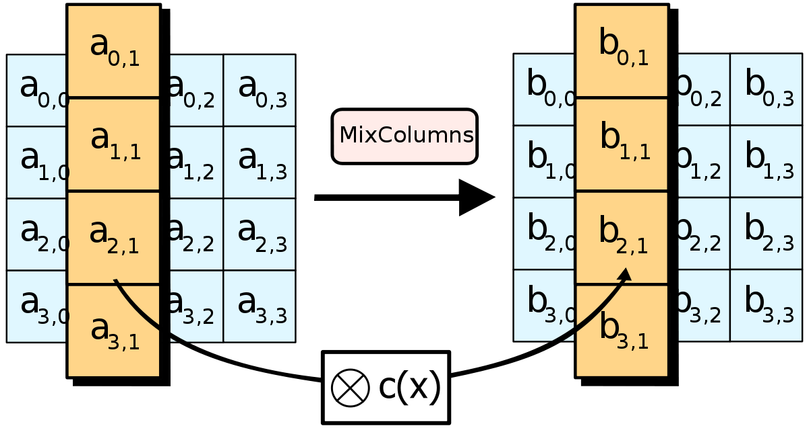
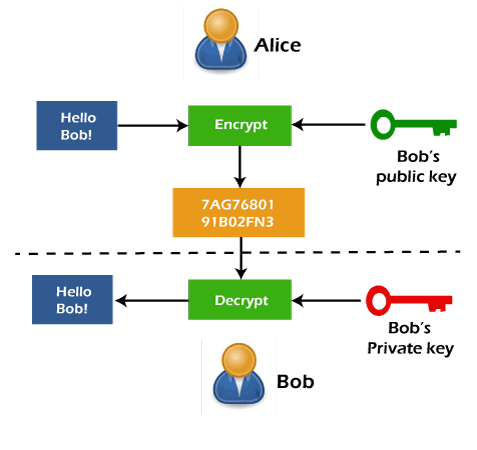

# OrangeCRYPT

Bu bir pyqt5 ile geliştirilmiş sezar algoritmasını kullanan şifreleme uygulamasıdır.

- Uygulama kısmı [main.py](source/main.py) dosyasında yapılmıştır.
- Şifreleme kısmı ise [orangeCrypt.py](source/orangeCrypt.py) dosyasında bulunmaktadır. 
- [untitled.ui](source/untitled.ui) arayüz kısmının tasarlandığı xml tabanlı dosyadır.

- Exe dosyasını [buradan indirebilirsiniz.](orangeCrypt.exe)

# Şifreleme Algoritmaları

## İçindekiler

1. [Giriş](#giriş)
2. [Klasik Şifreleme Algoritmaları](#klasik-şifreleme-algoritmaları)
   - 2.1 [Sezar Şifreleme](#sezar-şifreleme)
   - 2.2 [Vigenère Şifreleme](#vigenère-şifreleme)
3. [Modern Şifreleme Algoritmaları](#modern-şifreleme-algoritmaları)
   - 3.1 [DES (Data Encryption Standard)](#des-data-encryption-standard)
   - 3.2 [AES (Advanced Encryption Standard)](#aes-advanced-encryption-standard)
   - 3.3 [RSA](#rsa)

## Giriş

Şifreleme, gizli mesajları anlaşılmaz hale getirmek için kullanılan bir yöntemdir. Bu sunum, farklı türdeki şifreleme algoritmalarını ve bunların çalışma prensiplerini açıklamaktadır.

## Klasik Şifreleme Algoritmaları

Bu bölüm, tarihsel olarak kullanılan klasik şifreleme algoritmalarını içerir.

### Sezar Şifreleme

Sezar şifreleme, metinleri belirli bir anahtarla kaydırarak şifreleyen basit bir algoritmadır. Örneğin, anahtar olarak 3 seçilirse, A harfi C'ye, B harfi D'ye ve benzer şekilde kaydırılır. 

OrangeCrypt uygulamamızda sezar algoritmasını kullandık.

### Vigenère Şifreleme

Vigenère şifreleme, anahtar kelime veya cümle kullanarak metni şifreleyen bir algoritmadır. Anahtar kelimenin her bir harfi, metnin ilgili harfiyle birleştirilerek şifreleme yapılır.

| Anahtar      | P | Y | T | H | O | N |
|--------------|---|---|---|---|---|---|
| Anahtar No   | 15| 24| 19|  7| 14| 13|
| Şifrelenecek | S | İ | F | R | E |   |
| Şifre No     |18 | 8 | 5 |17 | 4 |   |
| Şifreli Metin| G | F | Y | Y | R |   |

## Modern Şifreleme Algoritmaları

Bu bölüm, günümüzde yaygın olarak kullanılan modern şifreleme algoritmalarını içerir.

### DES (Data Encryption Standard)

DES, IBM tarafından geliştirilen bir blok şifreleme algoritmasıdır. 56-bitlik bir anahtar kullanır ve metni 64-bitlik bloklara ayırarak şifreler.

### AES (Advanced Encryption Standard)

AES, NIST tarafından belirlenen bir standart olan Rijndael algoritmasına dayanan bir blok şifreleme algoritmasıdır. 128, 192 veya 256 bitlik anahtarlar kullanır ve metni 128-bitlik bloklara ayırarak şifreler.

### RSA

RSA, açık anahtarlı şifreleme için kullanılan bir algoritmadır. İki anahtar kullanır: biri şifreleme için açık anahtar, diğeri ise şifreyi çözmek için gerekli olan özel anahtardır. RSA, büyük sayıların çarpanlarını bulmak üzerine dayanır.

